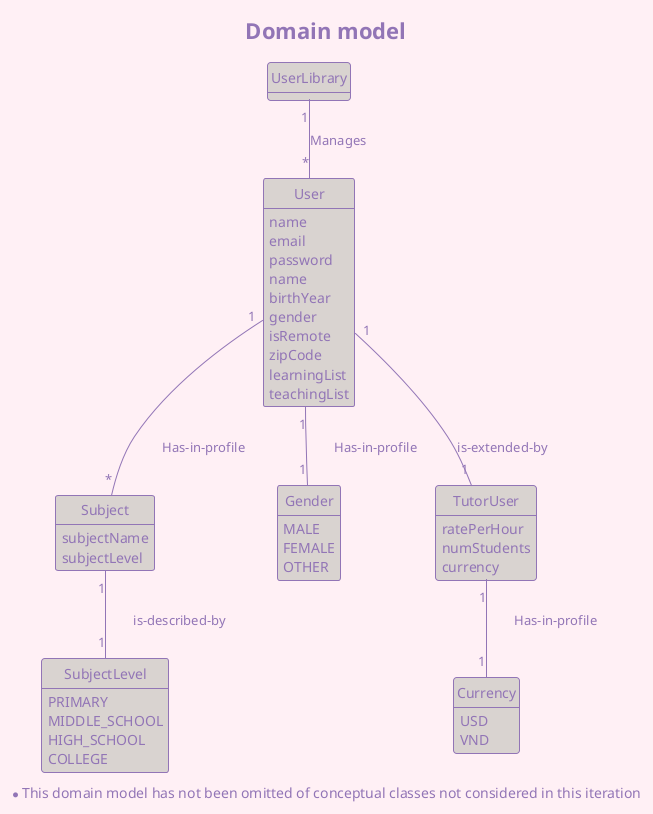
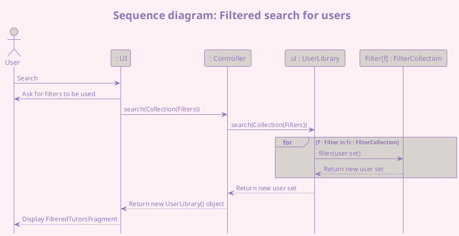
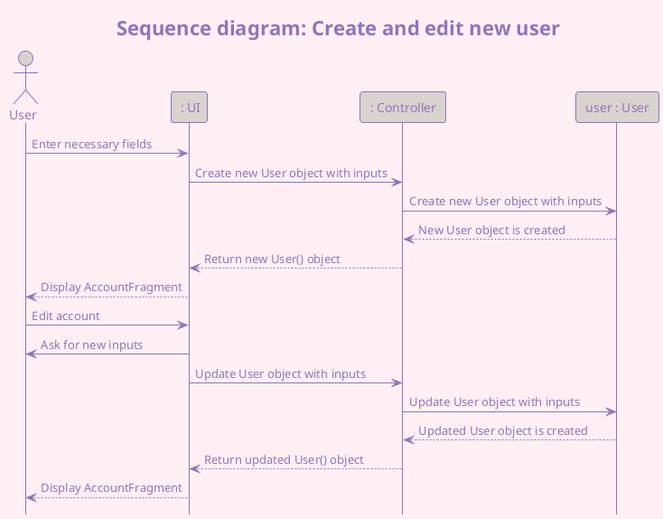
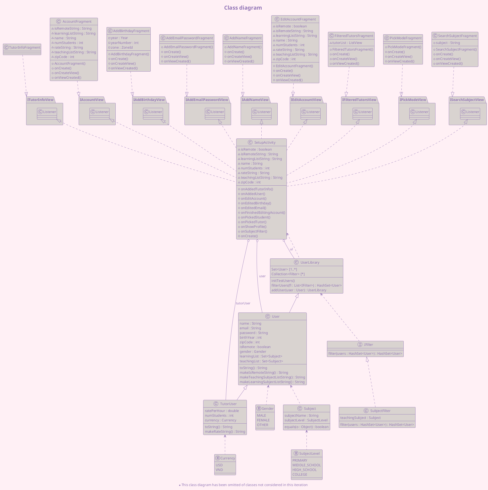

```plantuml
@startuml
hide circle
hide empty methods
!theme mimeograph
skinparam backgroundColor lavenderBlush

title Domain model
caption *This domain model has not been omitted of conceptual classes not considered in this iteration

' classes

class User {
    name
    email
    password
    name
    birthYear
    gender
    isRemote
    zipCode
    learningList
    teachingList
}

class Subject {
    subjectName
    subjectLevel
}

class SubjectLevel {
    PRIMARY
    MIDDLE_SCHOOL
    HIGH_SCHOOL
    COLLEGE
    }

class Gender {
    MALE
    FEMALE
    OTHER
}

class Currency {
    USD
    VND
    
}

class TutorUser {
    ratePerHour
    numStudents
    currency
}

class UserLibrary {
}

' associations
User "1" -- "1" TutorUser : is-extended-by\t\t

User "1" -- "*" Subject : \tHas-in-profile\t\t

User "1" -- "1" Gender : \tHas-in-profile\t\

TutorUser "1" -- "1" Currency : \tHas-in-profile\t\

Subject "1" -- "1" SubjectLevel : \tis-described-by\t\t

UserLibrary "1" -- "*" User : Manages\t\t

@enduml
```

```plantuml
@startuml
hide footbox
!theme mimeograph
skinparam backgroundColor lavenderBlush

title Sequence diagram: Filtered search for users

actor User as user
participant " : UI" as ui 
participant " : Controller " as control
participant " ul : UserLibrary " as ul 
participant " Filter[f] : FilterCollection " as filter

user -> ui : Search
ui -> user : Ask for filters to be used
ui -> control : search(Collection(Filters))
control -> ul : search(Collection(Filters))
group for [f : Filter in fc : FilterCollection] 
    ul -> filter : filter(user set)
    filter --> ul : Return new user set
    end
ul --> control : Return new user set
control --> ui : Return new UserLibrary() object 
ui --> user : Display FilteredTutorsFragment
@enduml
```

```plantuml
@startuml
hide footbox
!theme mimeograph
skinparam backgroundColor lavenderBlush

title Sequence diagram: Create and edit new user

actor User as user
participant " : UI" as ui 
participant " : Controller " as control
participant " user : User " as ul

user -> ui : Enter necessary fields
ui -> control : Create new User object with inputs
control -> ul : Create new User object with inputs
ul --> control : New User object is created 
control --> ui : Return new User() object 
ui --> user : Display AccountFragment 
user -> ui : Edit account 
ui -> user : Ask for new inputs 
ui -> control : Update User object with inputs
control -> ul : Update User object with inputs
ul --> control : Updated User object is created 
control --> ui : Return updated User() object 
ui --> user : Display AccountFragment 

@enduml
```

```plantuml
@startuml

title Class diagram
caption *This class diagram has been omitted of classes not considered in this iteration
!theme mimeograph
skinparam backgroundColor lavenderBlush

' classes

class User {
    name : String
    email : String
    password : String
    birthYear : int
    zipCode : int
    isRemote : boolean
    gender : Gender
    learningList : Set<Subject>
    teachingList : Set<Subject>
    --
    toString() : String
    makeIsRemoteString() : String
    makeTeachingSubjectListString() : String
    makeLearningSubjectListString() : String
}

 enum SubjectLevel {
    PRIMARY
    MIDDLE_SCHOOL
    HIGH_SCHOOL
    COLLEGE
}

enum Gender {
    MALE
    FEMALE
    OTHER
}

class Subject {
    subjectName : String
    subjectLevel : SubjectLevel
    --
    equals(o : Object) : boolean
}

class TutorUser {
    ratePerHour : double
    numStudents : int
    currency : Currency
    --
    toString() : String
    makeRateString() : String
}

enum Currency {
    USD
    VND
}

interface IFilter {
    --
    filter(users : HashSet<User>) : HashSet<User>
}

class SubjectFilter {
    teachingSubject : Subject
    --
    filter(users : HashSet<User>) : HashSet<User>
}


class SetupActivity {
~ isRemote : boolean
~ isRemoteString : String
~ learningListString : String
~ name : String
~ numStudents : int
~ rateString : String
~ teachingListString : String
~ zipCode : int
+ onAddedTutorInfo()
+ onAddedUser()
+ onEditAccount()
+ onEditedBirthday()
+ onEditedEmail()
+ onFinishedEditingAccount()
+ onPickedStudent()
+ onPickedTutor()
+ onShowProfile()
+ onSubjectFilter()
# onCreate()
}

class AccountFragment {
          ~ isRemoteString : String
          ~ learningListString : String
          ~ name : String
          ~ numStudents : int
          ~ rateString : String
          ~ teachingListString : String
          ~ zipCode : int
          + AccountFragment()
          + onCreate()
          + onCreateView()
          + onViewCreated()
      }
      
class AddBirthdayFragment {
          - year : Year
          - yearNumber : int
          - zone : ZoneId
          + AddBirthdayFragment()
          + onCreate()
          + onCreateView()
          + onViewCreated()
      }

class AddNameFragment {
          + AddNameFragment()
          + onCreate()
          + onCreateView()
          + onViewCreated()
      }

class EditAccountFragment {
          ~ isRemote : boolean
          ~ isRemoteString : String
          ~ learningListString : String
          ~ name : String
          ~ numStudents : int
          ~ rateString : String
          ~ teachingListString : String
          ~ zipCode : int
          + EditAccountFragment()
          + onCreate()
          + onCreateView()
          + onViewCreated()
      }

class FilteredTutorsFragment {
          ~ tutorList : ListView
          + FilteredTutorsFragment()
          + onCreate()
          + onCreateView()
          + onViewCreated()
      }

class AddEmailPasswordFragment {
          + AddEmailPasswordFragment()
          + onCreate()
          + onCreateView()
          + onViewCreated()
      }

class PickModeFragment {
          + PickModeFragment()
          + onCreate()
          + onCreateView()
          + onViewCreated()
      }

class SearchSubjectFragment {
          + subject : String
          + SearchSubjectFragment()
          + onCreate()
          + onCreateView()
          + onViewCreated()
      }

SetupActivity .up.|> IAccountView.Listener
SetupActivity .up.|> IAddBirthdayView.Listener
SetupActivity .up.|> IAddEmailPasswordView.Listener
SetupActivity .up.|> IAddNameView.Listener
SetupActivity .up.|> IEditAccountView.Listener
SetupActivity .up.|> IFilteredTutorsView.Listener
SetupActivity .up.|> IPickModeView.Listener
SetupActivity .up.|> ISearchSubjectView.Listener
SetupActivity .up.|> ITutorInfoView.Listener
SetupActivity o-- TutorUser : tutorUser
SetupActivity o-- UserLibrary : ul
SetupActivity o-- User : user
IAccountView <|.up. AccountFragment
IAddBirthdayView <|.up. AddBirthdayFragment
IAddNameView <|.up. AddNameFragment
IAddEmailPasswordView <|.up. AddEmailPasswordFragment
IEditAccountView <|.up. EditAccountFragment
IFilteredTutorsView <|.up. FilteredTutorsFragment
IPickModeView <|.up. PickModeFragment
ISearchSubjectView <|.up. SearchSubjectFragment
ITutorInfoView <|.up. TutorInfoFragment

class UserLibrary {
    Set<User> [1..*] 
    Collection<Filter> [*]
    --
    initTestUsers()
    filterUsers(fl : List<IFilter>) : HashSet<User>
    addUser(user : User) : UserLibrary
}

SetupActivity <.. UserLibrary
UserLibrary <|-- User
UserLibrary <.. IFilter
User <|-- TutorUser
User <.. Subject
User <.. Gender
TutorUser <.. Currency
Subject <.. SubjectLevel
IFilter <|.. SubjectFilter

@enduml
```