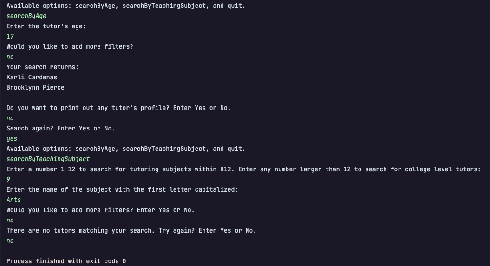

# System tests report 
The tests report include screenshots in which white texts are what the console printed out, 
and green texts are what the user entered.

## 1. Test: Searching tutors by age
- The user answers questions prompted by the system to configure the filter.
- Screenshot of a successful search by age that returns a list of filtered tutors:
      
- Screenshot of a successful search by age that returns no tutors:
     

## 2. Test: Searching tutors by teaching subjects
- The user answers questions prompted by the system to configure the filter. 
- Screenshot of a successful search by teaching subject that returns a list of filtered tutors:
      
- Screenshot of a successful search by teaching subject that returns no tutors:
      

## 3. Test: Showing profile of a selected tutor 
- The user types the name of the tutor and receives a textual representation of their profile.
- Screenshot of a successful call to show profile:
      
- Screenshot of an unsuccessful call to show profile in which user entered the name of the 
tutor incorrectly.   The system re-asks for the tutor's name and proceeded with the search.
      

## 4. Test: Searching tutors by both age and teaching subjects 
- The user answers questions prompted by the system to configure the filter. 
- Screenshot of a successful search that returns a list of filtered tutors:
     

## 5. Test: Consecutive searches 
- The user answers yes to the prompt "Search again? Enter Yes or No." to execute a new search.
- Screenshot of two successful consecutive searches:
       

## 6. Test: Quit 
- The user enters quit when the option is presented to terminate the search. 
- Screenshot of a successful call to quit:
     